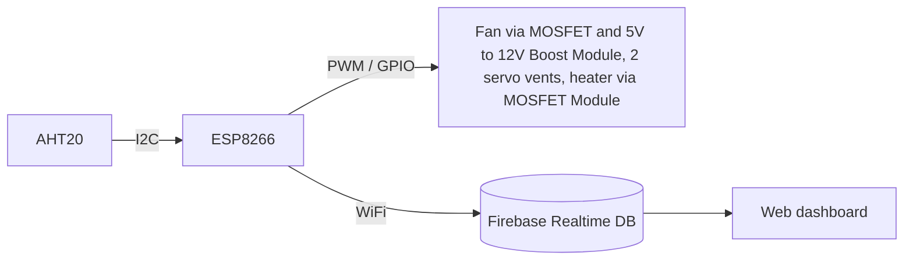

# Smart Dry Box IoT

A DIY smart dry box. An ESP8266 reads temperature and humidity, runs a three-state cycle (dehumidify, regenerate the desiccant plate, cool down) with two servo vents, a PWM fan and a heater output, and publishes its state to Firebase for a web dashboard.

> **Status:** working prototype (firmware V1 + dashboard V1). The firmware uses the Arduino framework with Firebase as the backend. A rewrite on ESP-IDF with a self-hosted local backend is planned.

## How it works

The firmware is a state machine with three states (`boxState`):

| State | Name | What happens | Exit condition |
|-------|------|--------------|----------------|
| 1 | Ready / dehumidifying | Idle until humidity >= 47% RH. Then the inner vent opens and the fan runs at low PWM. | Humidity <= 40% RH (back to idle), or 2 h timeout (go to state 2) |
| 2 | Regenerate desiccant plate | Outer vent opens, heater output on for 1.5 h with the fan at low PWM. | Timer ends |
| 3 | Cool down | Heater off, fan at full speed for 30 min, outer vent closes at the end. | Timer ends (back to state 1) |

Other details:

- AHT20 is read every 2 s over I2C.
- Fan is driven with PWM at 25 kHz (`analogWriteFreq(25000)`).
- Sensor values and device states are pushed to Firebase Realtime Database every 10 s, and immediately when an output changes.
- If WiFi is not available at boot, the box keeps running offline.

## Architecture



## Repository structure

```
smart-dry-box-iot/
├── firmware/
│   └── smart_dry_box/        # Arduino sketch (ESP8266)
│       ├── smart_dry_box.ino
│       └── secrets.example.h
├── dashboard/                # Web dashboard (Vite + Firebase)
└── README.md
```

## Hardware

| Part | Role |
|------|------|
| ESP8266 board NodeMCUv2 | Main controller |
| AHT20 | Temperature and humidity sensor (I2C, default `Wire` pins) |
| 2x servo | Inner and outer air vents |
| 12 V DC fan | Airflow, PWM-controlled at 25 kHz through one MOSFET |
| Boost converter (5 V to 12 V) | Supplies the fan from the 5 V rail |
| Relay | Switches the desiccant-plate heater during regeneration |

| Function | Pin |
|----------|-----|
| Servo 1 (inner vent) | D6 |
| Servo 2 (outer vent) | D7 |
| Fan (PWM, via MOSFET) | D5 |
| Heater relay | D3 |
| I2C (AHT20) | board default SDA/SCL |

## Firmware

### Requirements

- Arduino IDE
- ESP8266 board package: esp8266_nodemcuv2
- Libraries
  - Adafruit AHTX0
  - Adafruit Unified Sensor
  - Firebase ESP8266 Client (mobizt)
  - `Servo`, `Wire`, `ESP8266WiFi` (included with the ESP8266 core)

### Build and flash

1. Copy `firmware/smart_dry_box/secrets.example.h` to `secrets.h` in the same folder and fill in your WiFi and Firebase values. `secrets.h` is git-ignored and must never be committed.
2. Open `smart_dry_box.ino`.
3. Select the board: esp8266_nodemcuv2
4. Upload.

## Dashboard

Built with Vite and Firebase (Hosting and Functions).

```bash
cd dashboard
npm install
```

Create `dashboard/.env` with your Firebase web config, then:

```bash
npm run dev       # local development
npm run build     # production build
firebase deploy   # deploy to Firebase (requires firebase-tools and login)
```

## Roadmap

- [ ] Port the firmware from the Arduino framework to ESP-IDF (component-based structure, FreeRTOS tasks)
- [ ] Replace Firebase with a self-hosted local backend (MQTT broker + database on a home server)
- [ ] Update the dashboard to talk to the local backend

## Notes

The web dashboard was built with AI assistance; I wrote the firmware and hardware design myseft.
